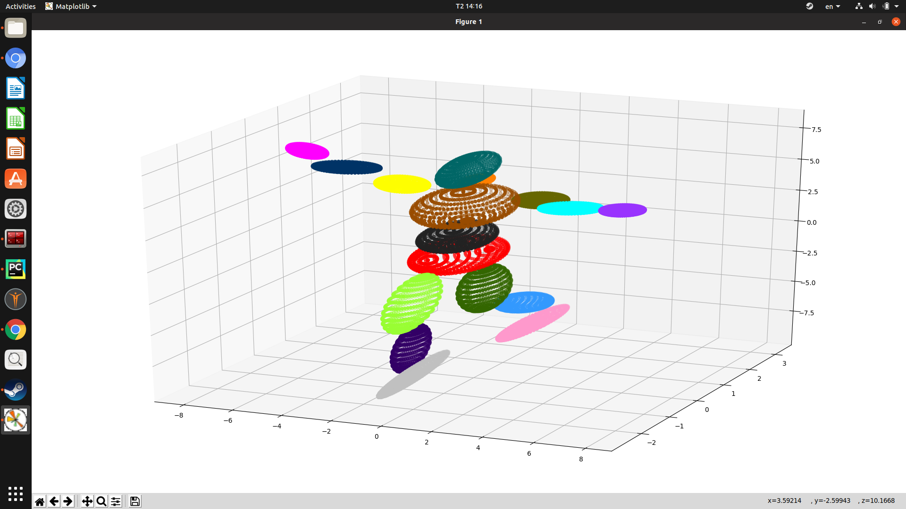

## Task in this week:
- To track the whole body from T-pose as frame 0 to frame 1

- To visualize the skeleton fitted to frame 1. The execution time is around 20 minutes due to the large number of points in the point cloud, we can use the techniques to reduce it, such as: PCA (don't use angle boundary and run with 10 iterations).

- To build class to present skeleton by bounding boxes.

